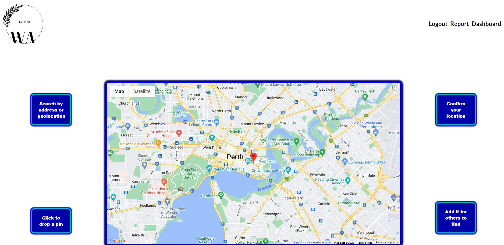
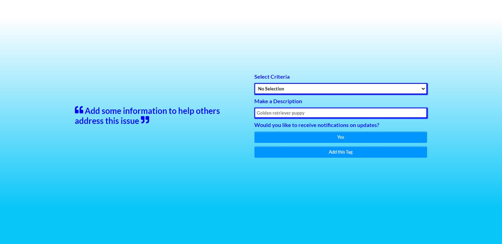
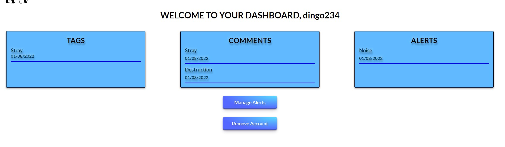
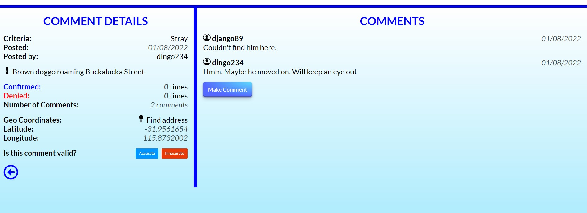

<div align="center">


</div>


<div align="center">

[](https://opensource.org/licenses/MIT) [](dwa) [](https://www.contributor-covenant.org/version/2/1/code_of_conduct/code_of_conduct.md) 

</div>

There are resources to report local issues. Issues that don't warrant calling 000, etc. Such as a lost dog or a tree fallen on the road. shire related issues in Australia. This feels like a simple alternative to be able to aleviate some of the stress relative to these issues and also server as a hub for community members to help solve them.

The application serves as a means for anybody that is interested to take a quick snap of an issues and log it for others to help solve. 

## Requirements

Accessible through website. Additionally, testing and development can be done by downloading the repo.

## Further Developments

### Additional Features

- The inclusion of markers on the map on page load, indicating other tags around a users location or a location they select.

- The inclusion of images to replace these markers indicating criteria which users can also refine (by criteria)

- The inclusion of images (ability to upload images) to help others indentify th eissue in question.

- The conversion of the application into a native application for mobile such that users can use their mobile to tag an issue rather than having to wait to get home.

### Further Changes

- Add functionality for email notifications if a user selects criteria in a location they wish to be notified about. On this, the inclusion of notifications on the website itself about new criteria or comments made against tags they are included in or tags they've made.

- Adding email and phone options (both for notifiations and dropping a cell for contact)

- Set timeouts on creating tags on the website, confirming or denying tags, and making new comments (per comment = 1, per reply to another user = 1 per new comment or additional reply)

## Table of Contents

* [Installation](#installation)
* [Credits](#credits)
* [Contribution](#contribution)
* [Features](#features)
* [Questions](#questions)
* [Extras](#extras)

## Installation

```
Install the repo
Add your string for the API key depicted inside report.js
npm run develop from root
```

## How to Use

The application can be run from the command line, npm run develop once key is in place on process.env. 

## Credits

[Dave Plummer](https://github.com/origin-42): Origin 42

## Contribution

Any of the future developments.

### How to Contribute

```
download application as depicted, fork "git checkout -b <name of fork>". Upload new changes to this fork for review with git push -u origin <forkname>
```

## Questions

Direct any questions too;

- [origin-42](https://github.com/origin-42)
- d.plummer89@hotmail.com

## Extras




